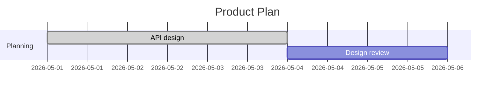

# Mermaid Gantt Editor

[English](https://github.com/yyamamot/mermaid-gantt-editor/blob/main/README.md) | 日本語

## Overview

Markdown source と Git でレビューしやすい差分を保ったまま、Mermaid Gantt を GUI で編集できます。

`Mermaid Gantt Editor` は、開発計画、リリース計画、移行作業、調査タスクなどを Markdown で管理するチーム向けの VS Code 拡張です。Mermaid Gantt source を Task Grid として開き、task、日付、依存関係、タグ、section を編集して、元の `.mmd` file または Markdown fenced block に書き戻します。

この拡張は Git-native、Markdown-native、lossless、Gantt-specific な編集を重視します。変更していない source は Pull Request で読みやすいまま残し、comment や未対応構文は可能な限り保持し、安全でない編集は diagnostics で知らせ、GitHub / GitLab / Obsidian などの Mermaid host でも引き続き表示できます。

<!-- screenshot: readme-task-grid -->
<p align="center">
  
</p>

この editor は短い review loop を前提にしています。Mermaid Gantt block を開き、Task Grid で編集し、Preview と Diagnostics を確認してから、source-safe な変更だけを元の file に書き戻します。

## ブラウザで試す

静的サイト版は [mermaid-gantt-editor.pages.dev](https://mermaid-gantt-editor.pages.dev/) で試せます。VS Code 拡張をインストールせずに、Task Grid、Mermaid Preview、source-safe editing、format review、share、PNG / SVG download の挙動を確認できます。

静的サイト版は編集体験の確認に向いています。Markdown CodeLens 連携、local workspace の diagnostics、ローカルの `.mmd` / Markdown file への書き戻しが必要な場合は VS Code 拡張を使ってください。

## この拡張でできること

- standalone `.mmd` Mermaid Gantt file を Gantt Editor で開く
- Markdown document 内の fenced `mermaid` Gantt block を CodeLens から開く
- task label、ID、start date、end date、duration、dependencies、tags を編集する
- section label と document settings を編集する
- section と task を追加、複製、移動、削除する
- 検索、sort、filter で大きな Gantt を確認する
- Mermaid preview を見ながら編集する
- duplicate ID、missing dependency、self reference、dependency cycle などの diagnostics を確認する
- 安全に直せる diagnostics に quick fix を適用する
- Mermaid Gantt source の整形を before / after で確認してから適用する
- rendered chart を SVG または PNG として export する
- structured editing が安全でない source は fallback diagnostics で確認する
- Markdown 内の対象 Mermaid block だけに変更を書き戻す

## Installation

Marketplace からインストールする場合:

1. VS Code の Extensions ビューを開く
2. `Mermaid Gantt Editor` または `mermaid-gantt-editor` を検索する
3. `Install` を押して有効化する
4. Mermaid Gantt を含む `.mmd` または Markdown file を開く

検証用には VSIX からのインストールもできます。

```sh
pnpm run package:vsix
pnpm run install:vsix
```

## Quick Start

### 1. Mermaid Gantt を用意する

`.mmd` file または Markdown fenced code block に Mermaid Gantt を書きます。

````markdown

````

### 2. Gantt Editor を開く

Markdown では Mermaid Gantt block の上に表示される CodeLens から `Gantt Editor を開く` を選びます。

Command Palette から開く場合は次を実行します。

- `Mermaid Gantt Editor: Gantt Editor を開く`

<!-- screenshot: readme-markdown-codelens -->
<p align="center">
  
</p>

### 3. Task Grid で編集する

Task Grid で label、ID、schedule、dependencies、tags を編集します。Preview は Mermaid chart を表示し、Details では選択 task や document settings を確認できます。

<!-- screenshot: readme-details -->
<p align="center">
  
</p>

### 4. Diagnostics を確認する

問題がある場合は Diagnostics に表示されます。Dependency issues は undefined reference、self reference、cycle の数、related source、次に取るべき操作をまとめて確認できます。安全に直せるものは quick fix から修正できます。

<!-- screenshot: readme-diagnostics -->
<p align="center">
  
</p>

### 5. 必要なら fallback diagnostics を確認する

未対応構文や危険な metadata がある場合、拡張は source を壊さないために structured editing を止め、diagnostics で理由を表示します。

<!-- screenshot: readme-fallback -->
<p align="center">
  
</p>

## Features

| 機能 | できること | 補足 |
| --- | --- | --- |
| Task Grid | Gantt task を表形式で編集 | label、ID、date、duration、dependency、tag に対応 |
| Markdown block editing | fenced `mermaid` Gantt block を直接開く | 複数 block がある Markdown でも対象 block だけを書き戻す |
| Mermaid preview | 編集中の chart を確認 | bundled Mermaid runtime を使用 |
| Details | 選択 task と document settings を編集 | Inspector / Diagnostics / retained source items などを切り替え |
| Diagnostics | 手書き source の問題を検出 | duplicate ID、dependency issues、date format mismatch など |
| Quick fix | 安全な修正を適用 | source range が明確なものだけを対象にする |
| Format Review | Mermaid Gantt source を確認してから整形 | syntax highlight 付きの before / after を見てから書き戻す |
| SVG / PNG export | rendered preview を保存 | docs、issue comment、release note で使える |
| Source-safe write-back | 変更範囲を絞って書き戻す | comment、directive、unknown syntax は保持する |
| Fallback diagnostics | 構造化編集が危険な source を保護 | Mermaid text は source editor 側に保持し、危険な write-back を避ける |
| Host compatibility | GitHub / GitLab / Obsidian 向け注意点を表示 | host 側 Mermaid runtime との差分確認を補助 |

## 主な使い方

### Markdown から開く

Markdown の fenced `mermaid` Gantt block の上に CodeLens が表示されます。`Gantt Editor を開く` を押すと、その block だけを対象に Gantt Editor が開きます。

### `.mmd` file から開く

standalone Mermaid Gantt file を開いた状態で Command Palette から `Mermaid Gantt Editor: Gantt Editor を開く` を実行します。

### Task を編集する

Task Grid の cell を直接編集します。`after` dependency は既存 task ID から選びやすく、date / duration は Mermaid Gantt の source に戻せる形で保持されます。

### Source order を壊さず確認する

検索、sort、filter は view-only です。表示順を変えても Mermaid source の task order は変わりません。

### Source を確認してから整形する

Task Grid header の `Format` を押すと、整形前後の Mermaid Gantt source を確認できます。before / after を確認してから適用します。

### Preview を export する

Preview の export menu から rendered chart を SVG または PNG として保存できます。

### 安全でない source を扱う

未対応 directive、保持対象の `click` / `call`、raw metadata などがある場合は diagnostics や fallback で知らせます。拡張が安全に書き戻せない source を勝手に正規化することは避けます。

## Source-safe editing

この拡張は Mermaid source を正本として扱います。GUI の都合で無関係な text を書き換えないことを重視しています。

- 変更していない source 領域を保持する
- comments、frontmatter、directives、raw text、unknown syntax を保持する
- Markdown document では対象 Mermaid block だけを書き戻す
- view-only sort / filter では source order を変えない
- Mermaid text は Pull Request や Codex / LLM による review に使える形で残す

## Limitations

| 事項 | 補足 |
| --- | --- |
| Gantt 専用 | flowchart、sequence diagram など Mermaid 全体の GUI editor ではありません |
| PM suite ではない | resource planning、cost tracking、baseline、formal critical path management は対象外です |
| Host rendering は host 依存 | GitHub / GitLab / Obsidian はそれぞれの Mermaid runtime と security policy を使います |
| すべての Mermaid Gantt 構文を GUI 編集するわけではない | 未対応構文は保持し、必要に応じて fallback します |
| Preview は補助 | 公開先での最終表示は target host でも確認してください |

## Requirements / Compatibility

| 項目 | 内容 |
| --- | --- |
| VS Code | Desktop 版 `1.105+` |
| Mermaid runtime | Extension bundled Mermaid `11.14.0` |
| 対象 file | `.mmd` Mermaid Gantt、Markdown fenced `mermaid` Gantt block |
| Marketplace package | `README.md` / `README.ja.md` と screenshot assets を同梱 |

## Source から build する

必要なもの:

- Node.js `22+`
- pnpm `10.30.3+`
- VS Code Desktop `1.105+`

依存関係を install して extension を build します。

```sh
pnpm install
pnpm run build
```

local VSIX を作成します。

```sh
pnpm run package:vsix
```

生成した VSIX を VS Code に install します。

```sh
pnpm run install:vsix
```

主な verification gate を実行します。

```sh
pnpm run verify
```

UI 変更時の確認:

```sh
pnpm run verify:ui-change -- --scenario task-grid --id <feature-id>
```

## License

- License: [MIT](./LICENSE)
