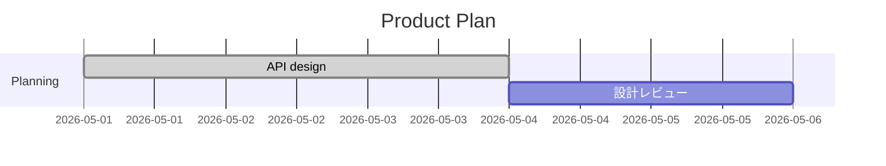

# Mermaid Gantt Editor

[日本語](https://github.com/yyamamot/mermaid-gantt-editor/blob/main/README.ja.md) | English

## Overview

`Mermaid Gantt Editor` is a VS Code extension for editing Mermaid Gantt diagrams in Markdown or `.mmd` files through a GUI.

Open a Mermaid Gantt block as a Task Grid, edit task labels, IDs, dates, durations, dependencies, and tags, then write the result back to the original Mermaid source. The Mermaid text stays in your repository, so it remains reviewable in pull requests and renderable by GitHub, GitLab, Obsidian, and other Markdown hosts.

It is designed for development teams that keep implementation plans, release plans, migrations, investigations, and lightweight schedules in Markdown. Use it when a full PM suite is too much, but hand-maintaining Mermaid Gantt source is too fragile.

<!-- screenshot: readme-task-grid -->
<p align="center">
  
</p>

## What You Can Do

- Open standalone `.mmd` Mermaid Gantt files in the Gantt Editor
- Open fenced `mermaid` Gantt blocks from Markdown using CodeLens
- Edit task labels, IDs, start dates, end dates, durations, dependencies, and tags
- Edit section labels and document settings
- Add, duplicate, move, and delete sections and tasks
- Search, sort, and filter large Gantt plans
- Preview the Mermaid chart while editing
- Review diagnostics such as duplicate IDs and missing dependencies
- Apply safe quick fixes when the source range is known
- Use raw source fallback when structured editing is not safe
- Write changes back only to the selected Mermaid block

## Installation

To install from the Marketplace:

1. Open the VS Code Extensions view
2. Search for `Mermaid Gantt Editor` or `mermaid-gantt-editor`
3. Press `Install`
4. Open a `.mmd` file or a Markdown file that contains Mermaid Gantt source

For local validation, you can also install a VSIX build.

```sh
pnpm run package:vsix
pnpm run install:vsix
```

## Quick Start

### 1. Create Mermaid Gantt source

Use either a `.mmd` file or a Markdown fenced code block.

````markdown

````

### 2. Open the Gantt Editor

In Markdown, use the `Open Gantt Editor` CodeLens above a Mermaid Gantt block.

From the Command Palette, run:

- `Mermaid Gantt Editor: Open Gantt Editor`

<!-- screenshot: readme-markdown-codelens -->
<p align="center">
  
</p>

### 3. Edit in the Task Grid

Edit labels, IDs, schedules, dependencies, and tags directly in the Task Grid. The Preview shows the Mermaid chart, and Details shows the selected task and document settings.

<!-- screenshot: readme-details -->
<p align="center">
  
</p>

### 4. Review Diagnostics

Problems are shown in Diagnostics. When a fix is safe, you can apply it through a quick fix.

<!-- screenshot: readme-diagnostics -->
<p align="center">
  
</p>

### 5. Use raw source fallback when needed

If the source contains unsupported syntax or risky metadata, the extension protects the Mermaid text by switching to raw source fallback instead of forcing structured edits.

<!-- screenshot: readme-fallback -->
<p align="center">
  
</p>

## Features

| Feature | What it does | Notes |
| --- | --- | --- |
| Task Grid | Edits Gantt tasks in a table | Supports labels, IDs, dates, durations, dependencies, and tags |
| Markdown block editing | Opens fenced `mermaid` Gantt blocks directly | Writes back only to the selected block in multi-block Markdown files |
| Mermaid preview | Shows the chart while editing | Uses the bundled Mermaid runtime |
| Details | Edits the selected task and document settings | Switch between Inspector, Diagnostics, Source, and more |
| Diagnostics | Finds common hand-written source problems | Duplicate IDs, undefined dependencies, date format mismatch, and more |
| Quick fix | Applies safe repairs | Only when the source range is explicit |
| Source-safe write-back | Keeps edits scoped | Preserves comments, directives, raw text, and unknown syntax |
| Raw source fallback | Protects source that is unsafe to structure-edit | Lets you keep editing without losing text |
| Host compatibility | Shows GitHub / GitLab / Obsidian guidance | Helps compare bundled Mermaid with host Mermaid behavior |

## Main Workflows

### Open from Markdown

A CodeLens appears above each fenced `mermaid` Gantt block. Press `Open Gantt Editor` to open the editor for that block.

### Open from a `.mmd` file

Open a standalone Mermaid Gantt file, then run `Mermaid Gantt Editor: Open Gantt Editor` from the Command Palette.

### Edit tasks

Edit cells directly in the Task Grid. `after` dependencies are easier to choose from existing task IDs, and dates / durations stay compatible with Mermaid Gantt source.

### Inspect without changing source order

Search, sort, and filter are view-only. Changing the view does not reorder tasks in the Mermaid source.

### Handle unsafe source

Unsupported directives, retained `click` / `call` statements, raw metadata, and other risky source patterns are surfaced through diagnostics or fallback. The extension avoids silently normalizing source it cannot safely edit.

## Source-Safe Editing

The extension treats Mermaid source as the source of truth and avoids rewriting unrelated text for GUI convenience.

- Preserves unchanged source regions
- Preserves comments, frontmatter, directives, raw text, and unknown syntax
- Writes back only to the target Mermaid block in Markdown
- Keeps source order unchanged when using view-only sort or filter
- Leaves Mermaid text readable for pull request and Codex / LLM review

## Limitations

| Limitation | Details |
| --- | --- |
| Gantt only | This is not a GUI editor for all Mermaid diagram types |
| Not a PM suite | Resource planning, cost tracking, baselines, and formal critical path management are out of scope |
| Host rendering depends on the host | GitHub, GitLab, and Obsidian use their own Mermaid runtime and security policy |
| Not every Mermaid Gantt construct is GUI-editable | Unsupported syntax is retained and may use fallback |
| Preview is guidance | Always verify final rendering in your target Markdown host when publishing |

## Requirements / Compatibility

| Item | Requirement |
| --- | --- |
| VS Code | Desktop `1.105+` |
| Mermaid runtime | Extension bundled Mermaid `11.14.0` |
| Supported files | `.mmd` Mermaid Gantt files and Markdown fenced `mermaid` Gantt blocks |
| Marketplace package | Includes `README.md`, `README.ja.md`, and screenshot assets |

## Build from Source

Requirements:

- Node.js `22+`
- pnpm `10.30.3+`
- VS Code Desktop `1.105+`

Install dependencies and build the extension:

```sh
pnpm install
pnpm run build
```

Package a local VSIX:

```sh
pnpm run package:vsix
```

Install the generated VSIX into VS Code:

```sh
pnpm run install:vsix
```

Run the main verification gate:

```sh
pnpm run verify
```

For UI changes:

```sh
pnpm run verify:ui-change -- --scenario task-grid --id <feature-id>
```

## License

- License: [MIT](./LICENSE)
