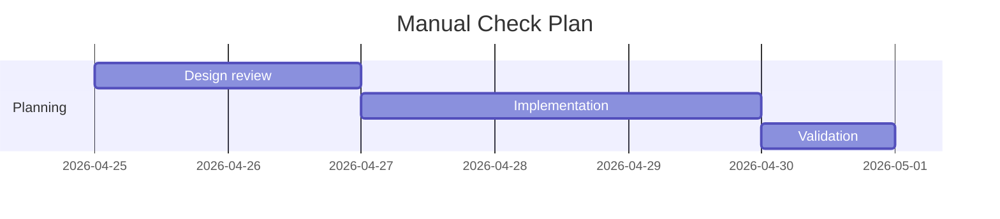
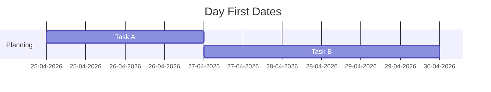
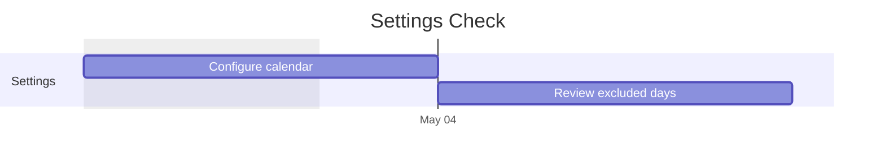
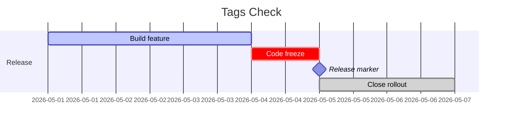
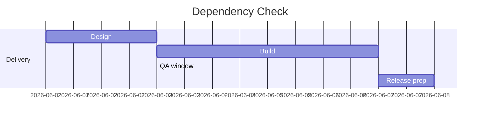
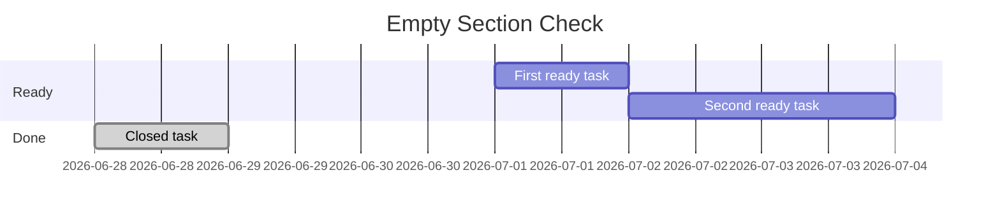
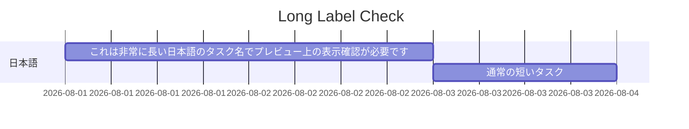
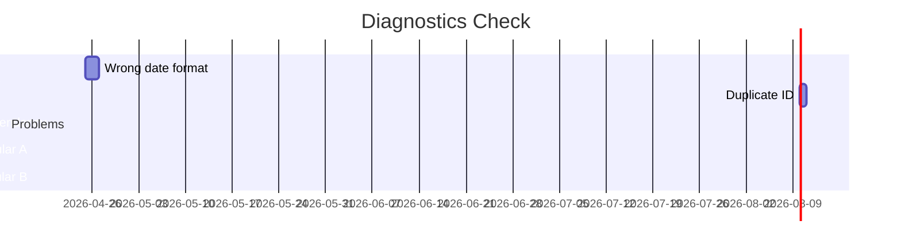

# Mermaid Gantt Manual Check

Use this workspace when launching the extension with F5.

Open this file or `basic.mmd`, then run **Mermaid Gantt Editor: Open Gantt Editor** from the command palette or the CodeLens above each Mermaid Gantt block.

## Basic Structured Editing

Use this block for the default happy path: edit task label, ID, start, duration, dependencies, tags, add task, move task, delete task, undo, redo, and preview collapse.



## Day First Date Format

Use this block to verify that `dateFormat DD-MM-YYYY` accepts day-first task dates without diagnostics.



## Document Settings

Use this block to exercise Document Settings: title, accessibility text, date format, axis format, tick interval, weekday, weekend, includes, excludes, today marker, and inclusive end dates.



## Tags And Milestone

Use this block to verify tag chips in Task Details. `milestone` should not automatically change duration.



## Dependencies And Until

Use this block to verify dependency picker behavior for `after` and `until`.



## Empty Section And Insert Position

Use this block to verify empty section rows and adding a task at the section top.



## Long Labels

Use this block to verify label readability, tooltips, Details editing, and preview behavior for long Japanese labels.



## Diagnostics Check

This block intentionally contains issues. Use it to verify Diagnostics, quick fixes, fallback behavior, and source-preserving write-back.



## Raw Source Retention

This block intentionally includes source items that are retained but not edited in the grid.

```mermaid
%%{init: { "theme": "forest" }}%%
gantt
title Source Retention Check
dateFormat YYYY-MM-DD
section Source
Open ticket : t1, 2026-09-01, 2d
Review ticket : t2, after t1, 1d
click t1 href "https://example.com/ticket/123"
vert 2026-09-02, Review marker
```

## Large Gantt 100 Tasks

100 task 程度の大規模表示確認用 Gantt です。Task Grid、Preview、Details drawer、検索、sort / filter、依存関係表示の手動確認に使います。

```mermaid
gantt
title Manual Large Gantt Fixture 100 Tasks
dateFormat YYYY-MM-DD
axisFormat %m/%d

section フェーズ01 要件整理と仕様確認
要件確認タスク 001 日本語ラベル長め : active, t001, 2026-05-01, 2d
Stakeholder interview 002 with long label : t002, after t001, 2d
既存資料レビュー 003 : t003, after t002, 1d
Scope alignment 004 : t004, after t003, 2d
用語整理と glossary 更新 005 : t005, 2026-05-04, 2d
Acceptance draft 006 : t006, after t004, 3d
リスク洗い出し 007 : t007, after t005, 1d
Dependency map 008 : t008, after t006, 2d
レビュー反映 009 : t009, after t007, 2d
要件ベースライン確定 010 : t010, after t008, 1d

section フェーズ02 Parser と AST
Parser spike 011 : active, t011, after t010, 2d
Lossless token audit 012 : t012, after t011, 3d
未対応構文保持確認 013 : t013, after t012, 2d
Range mapping 014 : t014, 2026-05-12, 2d
Comment preservation 015 : t015, after t014, 1d
Directive recovery 016 : t016, after t015, 2d
Link statement retention 017 : t017, after t016, 2d
AST summary fixture 018 : t018, after t013, 3d
Round trip audit 019 : t019, after t018, 2d
Parser checkpoint 020 : t020, after t019, 1d

section フェーズ03 Semantic Projection
Projection model 021 : active, t021, after t020, 2d
Group normalization 022 : t022, after t021, 2d
Task metadata mapping 023 : t023, after t022, 3d
日付設定 projection 024 : t024, 2026-05-20, 2d
Unsupported item policy 025 : t025, after t024, 2d
Preview source generation 026 : t026, after t023, 3d
Advanced source item list 027 : t027, after t025, 2d
Projection diagnostics 028 : t028, after t026, 2d
Semantic fixture update 029 : t029, after t027, 2d
Projection checkpoint 030 : t030, after t029, 1d

section フェーズ04 Resolver と Diagnostics
Resolver baseline 031 : active, t031, after t030, 2d
Duplicate id diagnostic 032 : t032, after t031, 1d
Undefined dependency diagnostic 033 : t033, after t032, 2d
循環依存チェック 034 : t034, after t033, 2d
Date format warning 035 : t035, 2026-05-28, 1d
Host compatibility profile 036 : t036, after t034, 3d
Quick fix payload review 037 : t037, after t035, 2d
Diagnostic table rendering 038 : t038, after t036, 2d
Severity filter review 039 : t039, after t037, 1d
Diagnostics checkpoint 040 : t040, after t038, 1d

section フェーズ05 Editor State と Write Back
Editor action model 041 : active, t041, after t040, 2d
Label update write back 042 : t042, after t041, 2d
Schedule update write back 043 : t043, after t042, 3d
依存関係 update write back 044 : t044, after t043, 2d
Tag update write back 045 : t045, 2026-06-05, 2d
Group move behavior 046 : t046, after t044, 2d
Task duplicate behavior 047 : t047, after t045, 2d
Delete guard behavior 048 : t048, after t046, 2d
Undo stack verification 049 : t049, after t047, 1d
Editor state checkpoint 050 : t050, after t049, 1d

section フェーズ06 Task Grid UI
Grid shell layout 051 : active, t051, after t050, 2d
Column sizing review 052 : t052, after t051, 2d
日本語ラベル折り返し確認 053 : t053, after t052, 2d
Search interaction 054 : t054, 2026-06-12, 1d
Sort interaction 055 : t055, after t054, 1d
Dependency picker 056 : t056, after t053, 3d
Row action menu 057 : t057, after t056, 2d
Details drawer tabs 058 : t058, after t055, 2d
Grid accessibility labels 059 : t059, after t057, 1d
Task Grid checkpoint 060 : t060, after t058, 1d

section フェーズ07 Preview と Edit Overlay
Preview render shell 061 : active, t061, after t060, 2d
Preview zoom controls 062 : t062, after t061, 1d
Focus preview mode 063 : t063, after t062, 2d
Preview edit mode 064 : t064, 2026-06-20, 3d
Drag operation model 065 : t065, after t064, 2d
Resize operation model 066 : t066, after t065, 2d
Mini editor apply 067 : t067, after t066, 2d
Unsupported task affordance 068 : t068, after t063, 2d
Preview evidence metadata 069 : t069, after t067, 2d
Preview checkpoint 070 : t070, after t069, 1d

section フェーズ08 Harness と Visual Review
Nightly harness baseline 071 : active, t071, after t070, 2d
Runtime JSONL review 072 : t072, after t071, 2d
Harness JSONL review 073 : t073, after t072, 2d
UI review report checks 074 : t074, 2026-06-28, 2d
Geometry metadata checks 075 : t075, after t074, 2d
Screenshot artifact review 076 : t076, after t075, 2d
VLM self review prompt 077 : t077, after t076, 2d
Feature wrapper verify 078 : t078, after t073, 3d
Visual regression notes 079 : t079, after t077, 1d
Visual checkpoint 080 : t080, after t078, 1d

section フェーズ09 Performance と Large Gantt
Large source generator 081 : active, t081, after t080, 2d
Task 100 smoke measure 082 : t082, after t081, 1d
Task 500 measure 083 : t083, after t082, 2d
Task 1000 measure 084 : t084, 2026-07-06, 2d
HTML render threshold 085 : t085, after t084, 1d
Heap delta tracking 086 : t086, after t085, 1d
Common action timing 087 : t087, after t083, 2d
Summary artifact review 088 : t088, after t086, 1d
性能警告ポリシー確認 089 : t089, after t087, 2d
Performance checkpoint 090 : t090, after t089, 1d

section フェーズ10 Release Readiness
README update 091 : active, t091, after t090, 1d
CHANGELOG draft 092 : t092, after t091, 1d
VSIX smoke 093 : t093, after t092, 2d
Package manifest review 094 : t094, 2026-07-14, 1d
Localization key review 095 : t095, after t094, 1d
Manual verification pass 096 : t096, after t093, 2d
Known limitations review 097 : t097, after t096, 1d
Release checklist 098 : t098, after t097, 1d
最終レビュー 099 : t099, after t098, 1d
Release candidate 100 : t100, after t099, 1d
```


